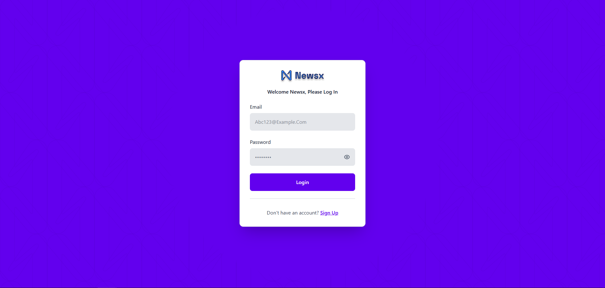

# Blog Post Management System

A full-stack blog management platform with an admin dashboard for creating, editing, and publishing blog posts. Built with React, Node.js, Express, and MongoDB.

## 🌐 Live Demo

**Frontend URL:** [https://blog-post-website-frontend.netlify.app](https://blog-post-website-frontend.netlify.app)  
**Backend API:** [https://blog-post-website-backend.onrender.com/api](https://blog-post-website-backend.onrender.com/api)

### Demo Credentials
```
Email: mohamim@gmail.com
Password: hamham
```

## 📸 Screenshots

### Public Routes

#### 1. Blog Listing Page (`/blog-list`)
Browse all published blog posts with category filters and search functionality.


**Features:**
- Category sidebar
- Pagination
- Responsive card layout


**Live URL:** [https://blog-post-website-frontend.netlify.app/blog-list](https://blog-post-website-frontend.netlify.app/blog-list)

---

#### 2. Recent Blogs Page (`/recent-blogs`)
Showcase of the most recent blog posts in a grid layout.


**Features:**
- Modern grid layout
- Featured images
- Author avatars
- Publication dates
- Category tags

**Live URL:** [https://blog-post-website-frontend.netlify.app/recent-blogs](https://blog-post-website-frontend.netlify.app/recent-blogs)

---

### Authentication Routes

#### 3. Login Page (`/login`)
Secure user authentication interface.



**Features:**
- Email/password authentication
- Form validation
- Error handling
- Redirect to dashboard after login

**Live URL:** [https://blog-post-website-frontend.netlify.app/login](https://blog-post-website-frontend.netlify.app/login)

---

#### 4. Sign Up Page (`/signup`)
New user registration page.

**Features:**
- User registration form
- Password strength validation
- Email verification
- Automatic login after registration

**Live URL:** [https://blog-post-website-frontend.netlify.app/signup](https://blog-post-website-frontend.netlify.app/signup)

---

### Protected Routes (Requires Authentication)

#### 5. Dashboard Home (`/`)
Main dashboard overview with blog post statistics.


**Features:**
- Total posts count
- Recent posts table

**Live URL:** [https://blog-post-website-frontend.netlify.app/](https://blog-post-website-frontend.netlify.app/) _(Login required)_

---

#### 6. Content Manager (`/content-manager`)
Advanced content management interface for creating and managing blog posts.


**Features:**
- Collection types sidebar
- Post creation and editing
- Image upload
- Category and tag management
- Draft/publish workflow

**Live URL:** [https://blog-post-website-frontend.netlify.app/content-manager](https://blog-post-website-frontend.netlify.app/content-manager) _(Login required)_

---

#### 7. Blog Post Form (Create/Edit)
Comprehensive blog post editor with rich text capabilities.


**Features:**
- Image upload 
- Category multi-select
- Tag management
- SEO meta description
- Publish date and time picker
- Featured post toggle
- Save as draft or publish
- Post information panel

**Access:** Click "New Blog Post" button or edit existing post _(Login required)_

---

## 🚀 Features

### Frontend Features
- **User Authentication** - Secure login and registration system
- **Blog Post Management**
  - Create, edit, and delete blog posts
  - Image upload with Cloudinary integration
  - Category and tag management
  - Draft and publish functionality
- **Admin Dashboard**
  - Post statistics and analytics
  - Content management interface
  - User-friendly sidebar navigation
- **Public Blog Pages**
  - Blog listing page with category filters
  - Recent blogs showcase
  - Responsive design for all devices

### Backend Features
- RESTful API architecture
- JWT-based authentication
- Image upload to Cloudinary
- MongoDB database with Mongoose ODM
- Protected routes with middleware
- Error handling and validation

## 🛠️ Tech Stack

### Frontend
- **React** - UI library
- **React Router** - Client-side routing
- **Axios** - HTTP client
- **Tailwind CSS** - Styling
- **Lucide React** - Icons
- **Vite** - Build tool

### Backend
- **Node.js** - Runtime environment
- **Express.js** - Web framework
- **MongoDB** - Database
- **Mongoose** - ODM
- **JWT** - Authentication
- **Cloudinary** - Image storage
- **Multer** - File upload handling
- **Bcrypt** - Password hashing

## 📋 Prerequisites

Before you begin, ensure you have the following installed:
- Node.js (v14 or higher)
- npm or yarn
- MongoDB (local or Atlas account)
- Cloudinary account

## 🔧 Installation

### 1. Clone the Repository
```bash
git clone https://github.com/mohamim360/Blog-Post-Website-Frontend.git
```

### 2. Backend Setup

```bash
# Navigate to backend directory
cd backend

# Install dependencies
npm install

# Create .env file
touch .env
```

Add the following environment variables to `.env`:
```env
# Server Configuration
PORT=3000
NODE_ENV=development

# Database
MONGODB_URI=your_mongodb_connection_string

# JWT Configuration
JWT_SECRET=your_jwt_secret_key
JWT_EXPIRE=7d

# Cloudinary Configuration
CLOUDINARY_CLOUD_NAME=your_cloud_name
CLOUDINARY_API_KEY=your_api_key
CLOUDINARY_API_SECRET=your_api_secret
```

```bash
# Start the backend server
npm start
# or for development with nodemon
npm run dev
```

### 3. Frontend Setup

```bash
# Navigate to frontend directory
cd ../frontend

# Install dependencies
npm install

# Create .env file
touch .env
```

Add the following environment variable to `.env`:
```env
VITE_API_URL=http://localhost:3000/api
```

```bash
# Start the development server
npm run dev
```

## 📁 Project Structure

```
blog-post-management/
├── backend/
│   ├── src/
│   │   ├── config/
│   │   │   ├── cloudinary.js
│   │   │   └── database.js
│   │   ├── controllers/
│   │   │   ├── authController.js
│   │   │   ├── blogPostController.js
│   │   │   └── uploadController.js
│   │   ├── middleware/
│   │   │   ├── authMiddleware.js
│   │   │   └── uploadMiddleware.js
│   │   ├── models/
│   │   │   ├── BlogPost.js
│   │   │   └── User.js
│   │   ├── routes/
│   │   │   ├── authRoutes.js
│   │   │   ├── blogPostRoutes.js
│   │   │   └── uploadRoutes.js
│   │   ├── services/
│   │   │   ├── authService.js
│   │   │   └── blogPostService.js
│   │   └── utils/
│   │       └── generateToken.js
│   ├── .env
│   ├── package.json
│   └── main.js
│
└── frontend/
    ├── src/
    │   ├── assets/
    │   ├── auth/
    │   │   ├── LoginPage.jsx
    │   │   ├── SignUpPage.jsx
    │   │   └── ProtectedRoute.jsx
    │   ├── components/
    │   │   ├── content/
    │   │   │   ├── BlogPostForm.jsx
    │   │   │   └── ContentManagerDashboard.jsx
    │   │   ├── Home/
    │   │   │   ├── BlogListingPage.jsx
    │   │   │   └── RecentBlogs.jsx
    │   │   ├── BlogPosts.jsx
    │   │   ├── DashboardContent.jsx
    │   │   ├── Header.jsx
    │   │   └── Sidebar.jsx
    │   ├── services/
    │   │   ├── api.js
    │   │   └── blogPostService.js
    │   ├── App.jsx
    │   ├── Dashboard.jsx
    │   └── main.jsx
    ├── public/
    │   └── _redirects
    ├── .env
    ├── package.json
    └── vite.config.js
```

## 🔐 API Endpoints

### Authentication
```
POST   /api/auth/register    - Register new user
POST   /api/auth/login       - Login user
GET    /api/auth/me          - Get current user (protected)
```

### Blog Posts
```
GET    /api/blog-posts              - Get all posts (with filters)
GET    /api/blog-posts/:id          - Get post by ID
GET    /api/blog-posts/slug/:slug   - Get post by slug
POST   /api/blog-posts              - Create new post (protected)
PUT    /api/blog-posts/:id          - Update post (protected)
DELETE /api/blog-posts/:id          - Delete post (protected)
PATCH  /api/blog-posts/:id/publish  - Publish post (protected)
```

### Upload
```
POST   /api/upload/image            - Upload image (protected)
DELETE /api/upload/image/:filename  - Delete image (protected)
```

## 🎯 Usage

### Creating a Blog Post

1. **Login** to the admin dashboard
2. Click on **"Content Manager"** in the sidebar
3. Select **"Post"** from the collection types
4. Click the **"New Blog Post"** button
5. Fill in the required fields:
   - Title
   - Summary
   - Blog Content
   - Categories
   - Tags
   - Author name
6. Upload an optional featured image
7. Click **"Save"** to save as draft or **"Publish"** to publish immediately

### Managing Posts

- **Edit**: Click the edit icon next to any post
- **Delete**: Click the delete icon and confirm

## 🚢 Deployment

### Frontend (Netlify)

1. Build the frontend:
```bash
cd frontend
npm run build
```

2. Create a `_redirects` file in the `public` folder:
```
/*    /index.html   200
```

3. Deploy to Netlify:
   - Connect your repository
   - Set build command: `npm run build`
   - Set publish directory: `dist`
   - Add environment variable: `VITE_API_URL`

### Backend (Render)

1. Ensure all environment variables are set
2. Add start script in `package.json`:
```json
"scripts": {
  "start": "node main.js",
  "dev": "nodemon main.js"
}
```

3. Deploy using your platform's CLI or web interface

## 🔒 Security Features

- Password hashing with bcrypt
- JWT token-based authentication
- Protected API routes
- Input validation and sanitization
- CORS configuration
- File upload restrictions (size, type)
